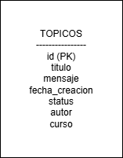

# ForoHub API

ForoHub es una API REST desarrollada con **Spring Boot** que permite gestionar tópicos de un foro.

## Tecnologías utilizadas

- Java 17
- Spring Boot 3
- Spring Web
- Spring Data JPA
- Spring Security
- H2 Database
- Maven

## Funcionalidades

La API permite:

- Crear un nuevo tópico
- Mostrar todos los tópicos
- Mostrar un tópico específico
- Actualizar un tópico
- Eliminar un tópico

## Endpoints

### Listar tópicos
GET /topicos

### Detallar un tópico
GET /topicos/{id}

### Crear tópico
POST /topicos

### Actualizar tópico
PUT /topicos/{id}

### Eliminar tópico
DELETE /topicos/{id}

## Base de datos

La base de datos contiene la tabla:

**topicos**

- id
- titulo
- mensaje
- fecha_creacion
- status
- autor
- curso

## Diagrama de Base de Datos

## Autor

Proyecto desarrollado por Arely Hernández como parte del **Challenge ForoHub - Alura Latam / Oracle ONE**.

